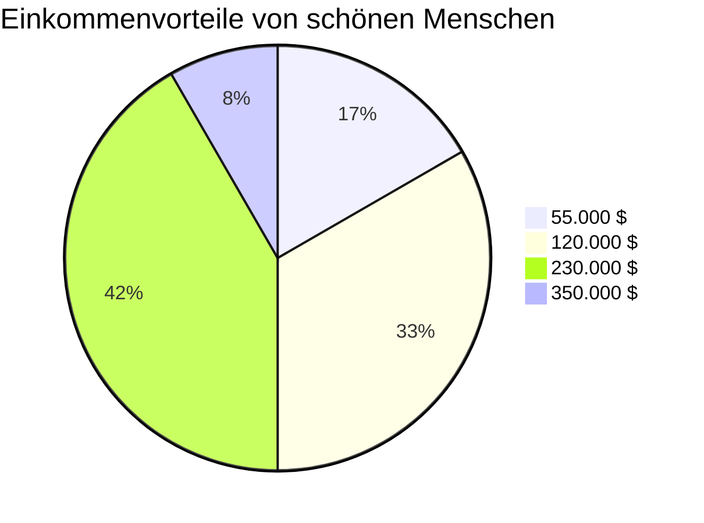

# Fragen Live

## Überblick

Wir arbeiten mit 8 Fragen. Die gliedern sich wie folgt:

- 1 ``Fun Fact Einstiegsfrage`` zum Warmlaufen
- 1 Frage zum Thema ``Oberflächlichkeit / Schönheit als Karrierefaktor``
- 1 Frage zum Thema ``Diskriminierung über den Vornamen``
- 2 Fragen zum Thema ``Diskriminierung von Frauen am Arbeitsmarkt``
- 1 Frage zum Thema ``Entscheidungsirrtümer bei Personalauswahl``
- 1 Frage zum Thema ``Diskriminierung von Menschen mit Behinderung``
- 1 Frage zum Thema ``Oberflächlichkeit / Titel in Österreich``

## Quellen

Ich habe über die ``Uni-Bibliothek`` recherchiert, nachfolgend die Namen der Publikationen und Links (*die fallweise nur mit VPN-Zugang funktionieren*).

Alles bis auf die Schönheitsfrage kommt von ``peer reviewed Artikeln``

Alle Quellen sind ``PDFs``

Ich möchte im Vortrag die Quellen nur kurz ansprechen und darauf hinweisen, dass wir eine ``Auflistung der Quellen auf umserer LinkedInSeite``, aber nicht zum Download - wer interessiert ist, soll uns kontaktieren

Beim ``Vortrag`` werde ich die ``wichtigsten Quellen ausgedruckt`` mitnehmen, falls Fragen kommen, die uns auf Glatteis führen könnten.

Ich füge die jeweiligen PDFs im Ganzen hier nicht an, weil das ein öffentliches Repo ist, hier sind die Links - wie schon gesagt, in den meisten Fällen braucht man eine Zugangsberechtigung z.B. Uni Salzburg Bibliothek VPN

- [Oberflächlichkeit / Schönheit](https://www.degruyter.com/document/doi/10.1515/9781400839445/html)

## Klassifizierung

Es werden vor allem ``Schätzfragen`` sein zu den ``jeweiligen Studienergebnissen``.

Die werden wir in die ``Kategorien 1,2,3,4`` einordnen.

Es gibt somit ``eine "richtige" Antwort`` und den ``Pie-Chart / Histogramm / etc. der Auswertung``. Diese Gegenüberstellung sollte schon ganz unterhaltsam sein.

Von der ``Reihung der Kategorien`` her gibt es ein ``Grundprinzip: Die Sichtweise, wie es um Gleichberechtigung in der Welt steht``. Wo 1 das Beste und 4 das Schlimmste ist

> Beispiel:  Antwortquote auf schriftliche Bewerbungen = 9 %. Bei Frauen mit Kindern ist diese: 1...9 %   2...7 %    3....5 %     4... < 5 %

## Übernahme / Auswertung

Es wäre fein, wenn die ``Farben der Pie-Charts von 1 bis 4  grün-gelbgrün-orange-rot``  wären.

Auf jeden Fall kann man in den Pie-Charts der Auswertung nochmals kurz die Frage anführen, sowie die Prozent und Auswahlwerte.

Und wir sagen dann, was die "richtige Antwort" war.

**Beispiel:**

> 
> #### Im Laufe eines gesamten Berufslebens in den USA beträgt der Einkommensvorteil von Menschen mit besonders hoher Attraktivität bis zu...:
>

## Die Fragen

### 1. Fun Fact Einstiegsfrage zum Warmlaufen / Hedy Lamarr

> 
> #### Die österreichische Schauspielerin und späterer Hollywood-Star der 30er-, 40er- und 50er-Jahre wurde vom Filmstudio MGM als schönste Frau der Welt vermarktet. Sie hat aber auch als Erfinderin 1942 etwas geschaffen, das heute noch hohe Bedeutung in der IT-Branche hat.
>

- 1...erstes Computerprogramm für automatische Webstühle
- 2...den ersten Compiler (*Live Erklärung: ein Programm zur Übersetzung von Programmiersprachen in für Computer verständliche Form. Einsen und Nullen. Die Basis von allem.*)
- 3...Den Begriff "bug"
- 4...Vorgängertechnologie von Bluetooth

Richtig ist 4. Alle Erfindungen sind von Frauen, und wir klären das dann bei der Auswertung auf. 2 und 3 ist ``Grace Hopper 1952 und 1947``, 1 ist ``Ada Lovelace in den 1830er Jahren``. 

### 2. Oberflächlichkeit / Schönheit

> 
> #### Im 2011 erschienen Buch " Beauty Pays : Why Attractive People Are More Successful" des amerikansichen Wirtschaftswissenschaftlers Daniel Hamermesh errechnet er den Einkommenvorteil von attraktiven Personen im Laufe Ihres Berufslebens. Dieser beträgt in den USA bis zu...:
>

-  1...55.000 $
-  2...120.000 $
-  3...230.000 $
-  4...350.000 $

Richtige Antwort: 3

### 3. Diskriminierung über die Vornamen

