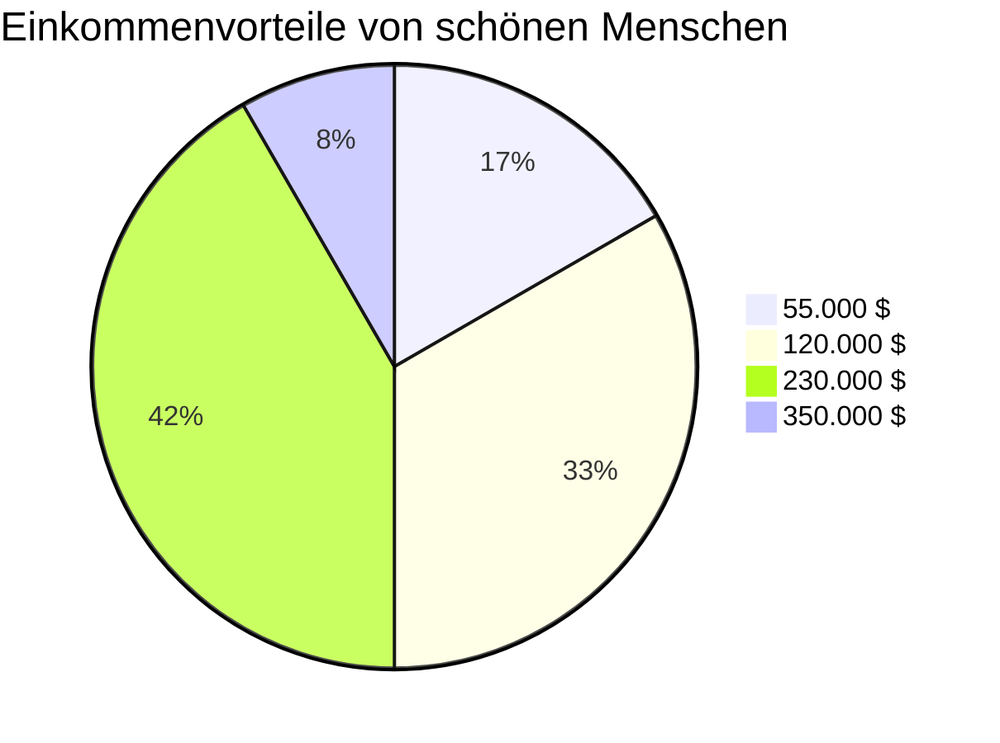

# Fragen Live

- [Fragen Live](#fragen-live)
  - [Überblick](#überblick)
  - [Quellen](#quellen)
  - [Klassifizierung](#klassifizierung)
  - [Übernahme / Auswertung](#übernahme--auswertung)
  - [Die Fragen](#die-fragen)
    - [1. Fun Fact Einstiegsfrage zum Warmlaufen / Hedy LAMARR](#1-fun-fact-einstiegsfrage-zum-warmlaufen--hedy-lamarr)
    - [2. Oberflächlichkeit / Schönheit](#2-oberflächlichkeit--schönheit)
    - [3. Diskriminierung über die Vornamen](#3-diskriminierung-über-die-vornamen)
    - [4. Diskriminierung von Frauen (1)](#4-diskriminierung-von-frauen-1)
    - [5. Diskriminierung von Frauen (2)](#5-diskriminierung-von-frauen-2)
    - [6. Lücken im Lebenslauf](#6-lücken-im-lebenslauf)
    - [7. Bedeutung von Bewerbungsfotos / Entscheidungskriterien der Personalverantwortlichen](#7-bedeutung-von-bewerbungsfotos--entscheidungskriterien-der-personalverantwortlichen)
    - [8. Behinderung und Arbeitsmarkt](#8-behinderung-und-arbeitsmarkt)

---

## Überblick

Wir arbeiten mit 8 Fragen. Die gliedern sich wie folgt:

- 1 ``Fun Fact Einstiegsfrage`` zum Warmlaufen
- 1 Frage zum Thema ``Oberflächlichkeit / Schönheit als Karrierefaktor``
- 1 Frage zum Thema ``Diskriminierung über den Vornamen``
- 2 Fragen zum Thema ``Diskriminierung von Frauen am Arbeitsmarkt``
- 1 Frage zum Thema ``Entscheidungsirrtümer bei Personalauswahl``
- 1 Frage zum Thema ``Bedeutung von Bewerbungsfotos``
- 1 Frage zum Thema ``Behinderung und Arbeitssuche``

[Zurück zum Inhalt](#fragen-live)

---

## Quellen

Ich habe über die ``Uni-Bibliothek`` recherchiert, nachfolgend die Namen der Publikationen und Links (*die fallweise nur mit VPN-Zugang funktionieren*).

Alles bis auf die Schönheitsfrage kommt von ``peer reviewed Artikeln``

Alle Quellen sind ``PDFs``

Ich möchte im Vortrag die Quellen nur kurz ansprechen und darauf hinweisen, dass wir eine ``Auflistung der Quellen auf umserer LinkedInSeite``, aber nicht zum Download - wer interessiert ist, soll uns kontaktieren

Beim ``Vortrag`` werde ich die ``wichtigsten Quellen ausgedruckt`` mitnehmen, falls Fragen kommen, die uns auf Glatteis führen könnten.

Ich füge die jeweiligen PDFs im Ganzen hier nicht an, weil das ein öffentliches Repo ist, hier sind die Links - wie schon gesagt, in den meisten Fällen braucht man eine Zugangsberechtigung z.B. Uni Salzburg Bibliothek VPN

- [Oberflächlichkeit / Schönheit](https://www.degruyter.com/document/doi/10.1515/9781400839445/html)
- [Diskriminierung aufgrund des Vornamens](https://ubsearch.sbg.ac.at/primo-explore/fulldisplay?docid=USB_almanz71311202060003331&context=L&vid=USB&lang=de_DE&search_scope=USB_local_data&adaptor=Local%20Search%20Engine&isFrbr=true&tab=default_tab&query=any,contains,emily%20and%20greg&sortby=date&facet=frbrgroupid,include,668147536&offset=0)
- [Gewichtsdiskriminierung von Frauen im Beruf](https://ubsearch.sbg.ac.at/primo-explore/fulldisplay?docid=TN_cdi_crossref_primary_10_1007_BF03372854&context=PC&vid=USB&lang=de_DE&search_scope=USB_local_data&adaptor=primo_central_multiple_fe&tab=default_tab&query=any,contains,diskriminierung%20frauen%20personalauswahl&offset=0)
- [Bewerbungsvorteile von Vätern](https://ubsearch.sbg.ac.at/primo-explore/fulldisplay?docid=TN_cdi_crossref_primary_10_1093_esr_jcx051&context=PC&vid=USB&lang=de_DE&search_scope=USB_local_data&adaptor=primo_central_multiple_fe&tab=default_tab&query=any,contains,personalauswahl%20diskriminierung&offset=0)
- [Lücken im Lebenslauf](https://ubsearch.sbg.ac.at/primo-explore/fulldisplay?docid=TN_cdi_crossref_primary_10_1026_0932_4089_a000237&context=PC&vid=USB&lang=de_DE&search_scope=USB_local_data&adaptor=primo_central_multiple_fe&tab=default_tab&query=any,contains,l%C3%BCcken%20im%20lebenslauf&offset=0)
- [Bedeutung von Fotos / Entscheidungskriterien der HR-Abteilungen](https://econtent.hogrefe.com/doi/10.1026/0932-4089/a000193)
- [Behinderung und Arbeitssuche mit / ohne Förderung](https://ubsearch.sbg.ac.at/primo-explore/fulldisplay?docid=TN_cdi_gale_infotracmisc_A506556134&context=PC&vid=USB&lang=de_DE&search_scope=USB_local_data&adaptor=primo_central_multiple_fe&tab=default_tab&query=any,contains,arbeitsmarkt%20alter%20diskriminierung&offset=0)

[Zurück zum Inhalt](#fragen-live)

---

## Klassifizierung

Es werden vor allem ``Schätzfragen`` sein zu den ``jeweiligen Studienergebnissen``.

Die werden wir in die ``Kategorien 1,2,3,4`` einordnen.

Es gibt somit ``eine "richtige" Antwort`` und den ``Pie-Chart / Histogramm / etc. der Auswertung``. Diese Gegenüberstellung sollte schon ganz unterhaltsam sein.

[Zurück zum Inhalt](#fragen-live)

---

## Übernahme / Auswertung

Es wäre fein, wenn die ``Farben der Pie-Charts von 1 bis 4  grün-gelbgrün-orange-rot``  wären.

Auf jeden Fall kann man in den Pie-Charts der Auswertung nochmals kurz die Frage anführen, sowie die Prozent und Auswahlwerte.

Von der ``Reihung der Kategorien`` her sollte es ein ``Grundprinzip: Die Sichtweise, wie es um Gleichberechtigung in der Welt steht`` geben. Wo 1 das Beste und 4 das Schlimmste ist

Und wir sagen dann, was die "richtige Antwort" war.

**Beispiel (Reihung im Uhrzeigersinn, aber noch ohne richtige Farben):**

> 
> #### Im Laufe eines gesamten Berufslebens in den USA beträgt der Einkommensvorteil von Menschen mit besonders hoher Attraktivität bis zu...:
>

[Zurück zum Inhalt](#fragen-live)

---

## Die Fragen

### 1. Fun Fact Einstiegsfrage zum Warmlaufen / Hedy LAMARR

> 
> #### Die österreichische Schauspielerin und späterer Hollywood-Star der 30er-, 40er- und 50er-Jahre wurde vom Filmstudio MGM als schönste Frau der Welt vermarktet. Sie hat aber auch als Erfinderin 1942 etwas geschaffen, das heute noch hohe Bedeutung in der IT-Branche hat.
>

- 1...erstes Computerprogramm für automatische Webstühle
- 2...den ersten Compiler (*Live Erklärung: ein Programm zur Übersetzung von Programmiersprachen in für Computer verständliche Form. Einsen und Nullen. Die Basis von allem.*)
- 3...Den Begriff "bug"
- 4...Vorgängertechnologie von Bluetooth

Richtig ist 4. Alle Erfindungen sind übrigens von Frauen, und wir klären das dann bei der Auswertung auf. 2 und 3 ist ``Grace HOPPER 1952 und 1947``, 1 ist ``Ada LOVELACE in den 1830er Jahren``. 

[Zurück zum Inhalt](#fragen-live)

---

### 2. Oberflächlichkeit / Schönheit

> 
> #### Im 2011 erschienen Buch " Beauty Pays : Why Attractive People Are More Successful" des amerikansichen Wirtschaftswissenschaftlers Daniel HAMERMESH errechnet er den Einkommenvorteil von attraktiven Personen im Laufe Ihres Berufslebens. Dieser beträgt in den USA bis zu...:
>

-  1...55.000 $
-  2...120.000 $
-  3...230.000 $
-  4...350.000 $

Richtige Antwort: 3

[Zurück zum Inhalt](#fragen-live)

---

### 3. Diskriminierung über die Vornamen

> 
> #### Marianne BERTRAND (University of Chicago) und Sendhil MULLAINATHAN (MIT Massachusetts Institute of Technology) haben 2004 in Boston und Chicago insgesamt 2.435 fiktive Bewerbungen ohne Foto auf verschiedene Stellenausschreibungen versendet, dabei entweder typische "weisse" oder "afro-amerikanische" Vornamen verwendet. Die durchschnittliche Rückmeldungen (Einladung zum Vorstellungsgespräch, mehr Fragen...) betrug bei den "weissen" Vornamen 9,65 %. Wie hoch war dieser Wert bei den "afro-amerikanischen" Vornamen?
>

-  1...9,65 %
-  2...6,45 %
-  3...3,45 %
-  4...8,5 %

Richtige Antwort: 2

[Zurück zum Inhalt](#fragen-live)

---

### 4. Diskriminierung von Frauen (1)

> 
> #### Dr. Susi STÖRMER, Professorin für Personalwirtschaft an der Universität Hamburg hat bei 14.532 Frauen und 15.145 Männern aus verschiedensten Berufen und Einkommenssparten nach Zusammenhängen zwischen Entlohnung und Body-Mass-Index gesucht. Die Studie wurde 2011 veröffentlicht. Demnach verdienen übergewichtige Männer durchschnittlich einen Euro mehr pro Stunde. Wie schaut es in dieser Gruppe bei den Frauen aus?
>

-  1...- 0,65 €
-  2...+ 1 €
-  3...+ 0,15 €
-  4...- 1,15 €

Richtige Antwort: 1

[Zurück zum Inhalt](#fragen-live)

---

### 5. Diskriminierung von Frauen (2)

> 
> #### 2017 haben Magnus BYGREN, Anni ERLANDSSON und Michael Gähler von den Universitäten Stockholm und Linköping 2.144 unterschiedlichste fiktive Bewerbungen versendet. Die höchste positive Rückmeldungsrate von den Unternehmen hatten kinderlose Männer (41.6 %) und Frauen (39,2 %). Väter kamen auf 39,1 %. Und Mütter....?
>
-  1...30,5 %
-  2...27,3 %
-  3...39,1 %
-  4...36,4 %

Richtige Antwort: 4  Anmerkung. Ich habe bewusst das Vorzeigeland Schweden gewählt.

[Zurück zum Inhalt](#fragen-live)

---

### 6. Lücken im Lebenslauf

> 
> #### Dominika WACH und Florian FRANK Technische Universität Dresden, Lehrstuhl für Arbeits- und Organisationspsychologie sowie Uwe P. KANNING, Hochschule Osnabrück, Fakultät Wirtschafts-, und Sozialwissenschaften haben versucht, in einer Gruppe von 2.225 Personen Zusammenhänge zwischen Lücken im Lebenslauf und beruflichem Erfolg zu finden. Als Kriterien für den Berufserfolg dienten Entwicklung und Höhe des Einkommens, beruflicher Status sowie subjektive Erfolgseinschätzungen. Die Studie kam zu welchem Schluss, wenn es um die Frage geht, ob Lücken im Lebenslauf geeignete Kriterien für die Personalauswahl sind?
>

-  1...keinesfalls empfehlenswert, keine signifikanten Zusammenhänge
-  2...Pluspunkt für Kandidat:innen wenn Reisen oder Pflege von Angehörigen der Grund waren
-  3...Minuspunkt für Kandidat:innen wenn Ursache Kündigung war
-  4...empfehlenswert, weil viele Lücken = wenig Berufserfolg und umgekehrt

[Zurück zum Inhalt](#fragen-live)

---

### 7. Bedeutung von Bewerbungsfotos / Entscheidungskriterien der Personalverantwortlichen

> 
> #### Uwe P. KANNING, Hochschule Osnabrück, Fakultät Wirtschafts-, und Sozialwissenschaften hat 244  Personalverantwortliche von deutschen Unternehmen jeder Größe befragt und versucht herauszufinden, welche Kriterien Ihre Personalentscheidungen am stärksten beeinflussen. Dabei sind z.B. Tipp- und Grammatikfehler ganz vorne, ebenso eine Übersichtliche Darstellung des Lebenslaufs (85 - 88 %). Mit 41,8 % liegt das Fehlen eines Bewerberfotos im Mittelfeld. Das ist aber ein Mittelwert aus allen Unternehmensgrößen. Wie sehr stört es die Kleinbetriebe bis 50 Mitarbeiter:innen, wenn das Foto bei den Bewerbungsunterlagen fehlt?
>

-  1...34.8 %
-  2...25.6 %
-  3...43,4 %
-  4...59,3 %

Richtige Antwort: 4

[Zurück zum Inhalt](#fragen-live)

---

### 8. Behinderung und Arbeitsmarkt

> 
> #### In einer Studie von Eva DEUCHERT und Lukas KAUER (beide Universität St. Gallen) verfassten 52 Personen mit Behinderung oder erhöhtem Förderbedarf in den Jahren 2011 bis 2013 insgesamt 384 schriftliche Bewerbungen. Alles in einem sehr betreuten Umfeld. Der positive Rücklauf im Sinne von Einladung zum Vorstellungsgespräch betrug 6,25 %. Wenn eine finanzielle Förderung im Rahmen der Bewerbung mit angeboten wurde, stieg dieser Wert auf 6,4 %. Wie hoch war der Wert, wenn keine Förderung angeboten wurde?
>

-  1...7,4 %
-  2...6,4 %
-  3...5,4 %
-  4...3.2 %

Richtige Antwort: 1
